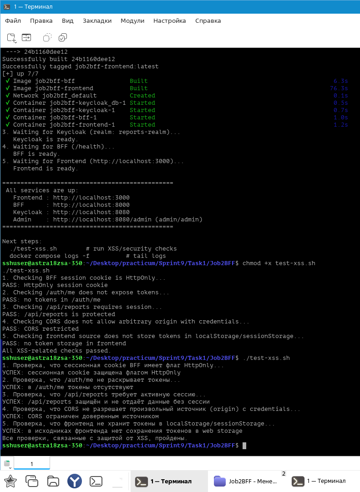

# Задача 2. Улучшение безопасности существующего приложения, заменой Code Grant на PKCE

## Описание 

Учтено требование реализации безопасной схемы работы с access- и refresh-токенами, которая исключает передачу фронтенду токенов, которые были получены от IdP.

Для этого выполнена безопасная аутентификацию веб-приложения через **Keycloak** с использованием паттерна **Backend-for-Frontend (BFF)** и **«Прокси для токенов»** (Token Handler) на базе **PKCE**.

BFF добавлен, чтобы исключить возможность кражи Keycloak-токенов через XSS: фронтенд никогда не видит `access_token` и `refresh_token`, они хранятся только на серверной стороне BFF.

## Схема взаимодействия

```
┌──────────────┐       HttpOnly cookie        ┌──────────────┐   client_secret   ┌──────────────┐
│              │  ───────────────────────────>│              │  ───────────────> │              │
│  Frontend    │      /auth/login             │     BFF      │   PKCE (S256)     │   Keycloak   │
│  (React)     │      /api/reports            │  (Express)   │  code exchange    │  (IdP)       │
│              │  <───────────────────────────│              │  <─────────────── │              │
└──────────────┘      JSON без токенов        └──────────────┘   access/refresh  └──────────────┘
      :3000                                         :8000                              :8080
```

Описание:

- **Фронтенд** — обычный SPA на React. Обращается только к BFF по `credentials: 'include'`. Не знает ничего о Keycloak.
- **BFF** — единственный, кто общается с Keycloak. Хранит `client_secret`, `access_token` и `refresh_token` **у себя в серверной сессии**. Фронтенду отдаёт только `HttpOnly`-cookie.
- **Keycloak** — Identity Provider. Содержит realm `reports-realm`, пользователей и три клиента:
  - `reports-bff` — confidential-клиент для BFF (с `client_secret`, PKCE `S256`).
  - `reports-frontend` — public-клиент (оставлен для совместимости, фронт его не использует).
  - `reports-api` — bearer-only клиент, подразумеваемый downstream-API.

---

## Структура проекта

```
.
├── bff/
│   ├── Dockerfile
│   ├── package.json
│   └── server.js                 # BFF: login, callback, session, proxy /api/*
├── frontend/
│   ├── Dockerfile
│   ├── package.json
│   ├── tsconfig.json
│   ├── tailwind.config.js
│   ├── nginx.conf
│   └── src/
│       ├── index.tsx
│       ├── index.css
│       ├── App.tsx
│       └── components/
│           └── ReportPage.tsx    # кнопка Login и Download Report
├── keycloak/
│   └── realm-export.json         # импорт realm при старте Keycloak
├── docker-compose.yaml
├── start.sh                      # скрипт запуска
├── test-xss.sh                   # проверки защиты от XSS
└── README.md
```

---

## Описание работы

### 1. Вход пользователя

1. Пользователь нажимает **Login** на фронтенде.
2. Фронт делает редирект на `GET /auth/login` BFF.
3. BFF генерирует `state` и `code_verifier`, считает `code_challenge = S256(verifier)` и редиректит браузер в Keycloak.
4. Пользователь вводит логин/пароль в форме Keycloak.
5. Keycloak редиректит обратно на `GET /auth/callback` BFF с `code`.
6. BFF проверяет `state`, отправляет `code` + `code_verifier` + `client_secret` в Keycloak, получает `access_token`, `refresh_token`, `id_token`.
7. BFF сохраняет токены **в серверной сессии**, а браузеру ставит `HttpOnly`-cookie (`connect.sid`).
8. BFF редиректит браузер обратно на фронтенд (`http://localhost:3000`).

### 2. Работа с API

1. Фронт вызывает `fetch('/api/reports', { credentials: 'include' })`.
2. Браузер автоматически прикрепляет cookie сессии BFF.
3. BFF берёт `access_token` из сессии, при необходимости обновляет через `refresh_token`.
4. BFF делает запрос к downstream-API (или возвращает мок-данные).
5. BFF отдаёт фронту **только данные**, без токенов.

### 3. Защита от XSS

| Угроза                                | Как защищаемся                                                    |
| ------------------------------------- | ----------------------------------------------------------------- |
| Кража токенов через `document.cookie` | Cookie сессии имеет флаг `HttpOnly` — JS её не читает             |
| Кража токенов через `localStorage`    | Токены вообще не попадают на фронт                                |
| Подмена `client_secret`               | Секрет хранится только на сервере BFF                             |
| Перехват authorization code           | Code бесполезен без `code_verifier` (PKCE)                        |
| CSRF с чужого origin                  | CORS разрешает только `http://localhost:3000`, `SameSite=Lax`     |
| Утечка токена через `/auth/me`        | Эндпоинт возвращает только данные пользователя, без токенов       |

---

## Запуск

### Требования

- Docker 20.10+
- Docker Compose v2 (`docker compose`) — рекомендуется
- `curl` (для `start.sh` и `test-xss.sh`)

### Команды

```bash
chmod +x start.sh
./start.sh
```

Скрипт:

1. Останавливает и удаляет старые контейнеры и тома.
2. Собирает и поднимает сервисы.
3. Ждёт готовности Keycloak, BFF и фронтенда.

После запуска доступны:

| Сервис            | URL                             | Учётные данные |
| ----------------- | ------------------------------- | -------------- |
| Frontend          | http://localhost:3000           | —              |
| BFF               | http://localhost:8000           | —              |
| Keycloak          | http://localhost:8080           | admin / admin  |
| Keycloak Admin UI | http://localhost:8080/admin     | admin / admin  |


## Переменные окружения

### Сервис `bff` (в `docker-compose.yaml`)

| Переменная              | Значение по умолчанию                 | Назначение                                            |
| ----------------------- | ------------------------------------- | ----------------------------------------------------- |
| `PORT`                  | `8000`                                | Порт BFF                                              |
| `KEYCLOAK_INTERNAL_URL` | `http://keycloak:8080`                | Адрес Keycloak внутри docker-сети (server-to-server)  |
| `KEYCLOAK_PUBLIC_URL`   | `http://localhost:8080`               | Адрес Keycloak для браузера                           |
| `REALM`                 | `reports-realm`                       | Имя realm                                             |
| `CLIENT_ID`             | `reports-bff`                         | clientId confidential-клиента                         |
| `CLIENT_SECRET`         | `bff-secret-change-me`                | client_secret (должен совпадать с realm-export.json)  |
| `REDIRECT_URI`          | `http://localhost:8000/auth/callback` | redirect URI для Keycloak                             |
| `FRONTEND_URL`          | `http://localhost:3000`               | Разрешённый origin для CORS                           |
| `SESSION_SECRET`        | `change-me`                           | Секрет для подписи cookie сессии                      |

### Сервис `frontend`

| Переменная          | Значение                | Назначение      |
| ------------------- | ----------------------- | --------------- |
| `REACT_APP_BFF_URL` | `http://localhost:8000` | Базовый URL BFF |

---

## Тестовые пользователи

Импортируются из `keycloak/realm-export.json`.

| Логин        | Пароль         | Роль             |
| ------------ | -------------- | ---------------- |
| `user1`      | `password123`  | `user`           |
| `user2`      | `password123`  | `user`           |
| `admin1`     | `admin123`     | `administrator`  |
| `prothetic1` | `prothetic123` | `prothetic_user` |
| `prothetic2` | `prothetic123` | `prothetic_user` |
| `prothetic3` | `prothetic123` | `prothetic_user` |


## Проверка безопасности

Скрипт `test-xss.sh` проверяет 5 инвариантов, из-за которых XSS не сможет украсть токены.

```bash
chmod +x test-xss.sh
./test-xss.sh
```

Тестовые проверки:

1. **HttpOnly-cookie сессии.** JS не может прочитать `document.cookie`.
2. **`/auth/me` не возвращает токенов.** Токены не утекают через API.
3. **`/api/reports` защищён.** Без сессии — `401`.
4. **CORS ограничен доверенным origin.** Сторонний сайт не прочитает ответы.
5. **Фронт не хранит токены в `localStorage`/`sessionStorage`.**

---

<details> <summary> Пример успешного запуска и прогона тестов </summary>



 </details>

---
